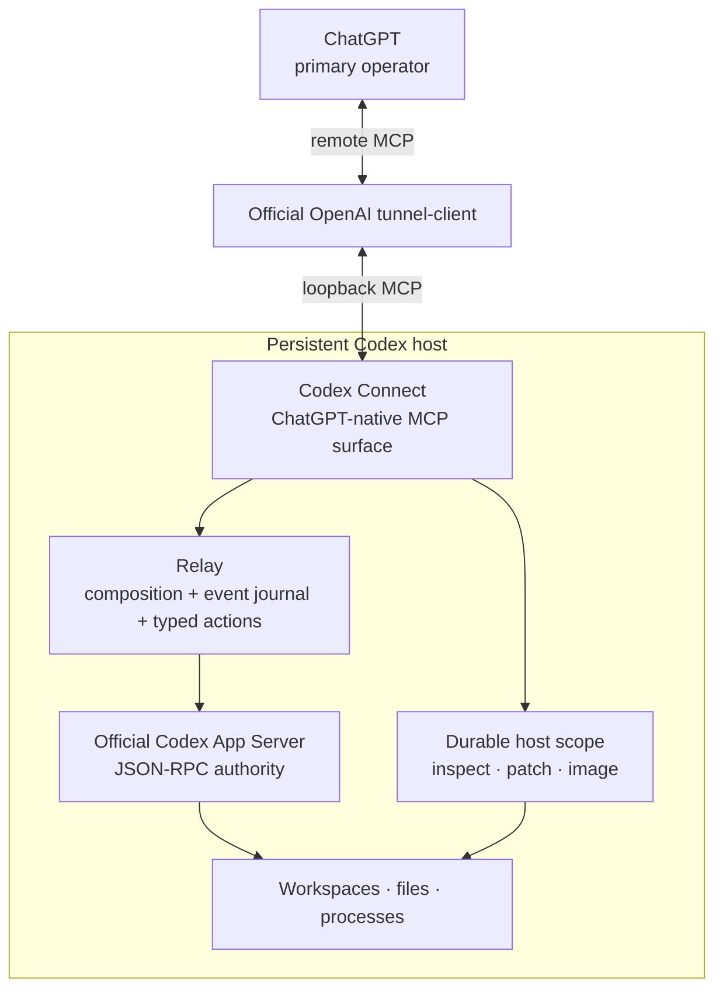
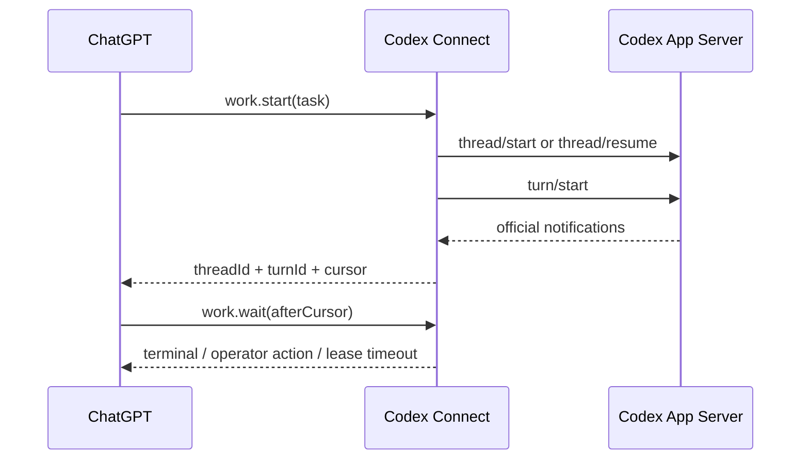

# Architecture

Codex Connect is a ChatGPT-native operator adapter over the official Codex App Server. It deliberately keeps one authority for Codex state: App Server.

## Topology



## Authority boundary

Codex Connect does **not** define another agent/session model.

- App Server owns thread and turn state.
- `work.start` composes `thread/start` or `thread/resume` with `turn/start`.
- `work.steer` maps to `turn/steer`.
- `work.interrupt` maps to `turn/interrupt`.
- `review` maps to inline `review/start`.
- Every public result preserves official App Server identifiers.

Connect-owned state is observational or transport-specific only: the bounded event journal and pending server-request registry. Neither is authoritative Codex state.

## Event-driven work

App Server emits turn, item, plan, diff, usage, and lifecycle notifications. The relay records a bounded recent journal with a monotonically increasing local cursor while retaining the original method and params.



`work.wait` is a bounded quiet join, not a progress subscription. Routine item lifecycle notifications, tool activity, file changes, and agent commentary continue to enter the bounded event journal but do not resolve the wait. The wait returns early only when the selected turn becomes terminal or operator action/input is required; otherwise it returns when its lease expires. A zero-duration wait can be used to pull the accumulated journal without blocking. The relay still performs periodic authoritative reconciliation so lost or oversized notifications cannot strand a completed turn.

## Typed action loop

Operator-actionable server requests are normalized into four categories:

- command/file approvals → `codexConnect.approval.respond`
- permission grants → `codexConnect.permissions.respond`
- MCP elicitation → `codexConnect.elicitation.respond`
- Codex semantic questions → `codexConnect.userInput.respond`

The pending registry preserves the exact official request ID, method, params, and correlated thread ID. Responders validate the action category and translate the compact public decision into the pinned official response shape. Unsupported server requests fail closed.

`item/tool/requestUserInput` is the one deliberate experimental exception. It is exposed because semantic worker questions materially improve operator collaboration; all other experimental App Server methods remain private and unavailable unless separately designed into the public surface.

## Host inspection boundary

`codexConnect.inspect` is the single read-only host inspection primitive. It supports batched:

- `readText`
- `readDirectory`
- `metadata`
- `searchContent`
- `searchNames`
- `fuzzyFileSearch`

Each inspection request may select a `cwd` inside the durable scope. Relative operation paths resolve from that request-local directory; omitted search paths mean the selected `cwd`, and omitted `cwd` means the durable scope root. The scope root remains the authorization boundary: there is no active-project state, alternate-root retry, or path fallback. One failed inspection operation is returned as an indexed error beside successful results; malformed batches and cancellation still fail the whole request.

All resolved paths are fenced to the configured durable root before an App Server filesystem request is sent. `readText`, `readDirectory`, and `metadata` use the pinned `fs/readFile`, `fs/readDirectory`, and `fs/getMetadata` RPCs. `readText` rejects files that cannot fit safely inside the shared App Server JSONL frame before issuing `fs/readFile`, then decodes the base64 payload and applies its existing line-range presentation. `readDirectory` similarly estimates the pinned response size from entry names and rejects listings that could exceed the shared transport frame before issuing the RPC; App Server remains authoritative for the returned entry data. `fuzzyFileSearch` uses the pinned App Server RPC of the same name and preserves its ranked result contract (`root`, relative `path`, `match_type`, `file_name`, `score`, and optional `indices`) without adding synthetic limits or truncation semantics; returned roots and paths are canonicalized and any match that escapes the selected scoped root, including through descendant symlinks, is dropped. Directory and metadata results use the App Server field names; in particular, metadata has `createdAtMs`, `modifiedAtMs`, `isFile`, `isDirectory`, and `isSymlink`, and no synthetic `sizeBytes` field because the official metadata RPC does not report one.

`searchContent` and `searchNames` remain native scoped operations. `searchNames` remains distinct from `fuzzyFileSearch`: it provides deterministic substring matching with caller-controlled result limits and an explicit truncation signal, while App Server fuzzy search returns ranked matches and may classify matches as files or directories. Content/name search does not follow symlinks, and build/cache directories are skipped where appropriate.

`apply_patch` and `view_image` remain native host primitives because their content semantics are more useful to ChatGPT than byte-oriented filesystem RPCs. They use the same request-local `cwd` convention as inspection.

## Command boundary

`command.exec` is reserved for a known deterministic command. It remains synchronous and bounded: the default timeout is 30 seconds, callers may extend it to 60 minutes, and captured stdout/stderr remains capped rather than allowing unbounded buffering. Interactive PTY continuation and unbounded execution are intentionally absent from the MCP surface until Codex Connect exposes explicit process ownership and termination. Autonomous investigation or coding belongs in `work.start`, where Codex owns its normal command/file lifecycle and approval flow. Workspace-write `writableRoots` must be absolute paths inside the durable scope. The upstream `networkAccess` boolean is passed through deliberately: `false` can prohibit socket creation, including localhost-based tests, while `true` is broader network access rather than a loopback-only grant. Codex Connect does not silently retry with broader permissions.

Setup sanitizes its execution `PATH` to absolute, non-empty directories and embeds that PATH in the persistent user-systemd backend unit. This gives App Server commands and workers the operator toolchain environment without wrapping commands in login shells or adding executable-specific lookup fallbacks.

## Protocol boundary

The App Server handshake explicitly sets:

```text
experimentalApi = true
requestAttestation = false
extensions["openai/form"] = {}
```

The dedicated pinned App Server process is launched with `default_mode_request_user_input`, `request_permissions_tool`, and `exec_permission_approvals` enabled. Codex Connect owns these process-local requirements rather than depending on a user's global Codex feature configuration.

The generated schema artifact contains only the internal requests and server-response contracts needed by the adapter, including the explicitly selected user-input request contract. Upstream App Server schema identifiers are preserved verbatim and do not define generations of the Codex Connect MCP surface. Adding an App Server method to that artifact does not make it a public MCP tool; public tools are deliberately designed around ChatGPT goals.

## Durable host scope

The backend has one durable host scope root, defaulting to `~/projects`. Project selection remains per operation through paths or official `cwd` fields. There is no active-project backend setting.

The durable root is workspace-oriented rather than repository-oriented. Git or another VCS may exist inside a workspace, but Codex Connect does not require one and agents must not introduce version-control workflow unless the operator explicitly requests it.

Path fencing is not a machine-wide sandbox. Commands, network access, `dangerFullAccess`, and `sudo` remain subject to Codex sandbox policy and the host user's OS permissions. See [Security](../../SECURITY.md).

## Runtime ownership

Codex Connect owns only its backend process. The official tunnel client owns tunnel credentials, profile state, reconnection, and lifecycle. Restarting or deploying Codex Connect must not recreate or supervise the tunnel runtime.

Deployment uses one durable operation id across an explicit prepare/status/activate/status transaction. `prepare` persists `building` and returns after handing compilation to a detached systemd job; that job eventually records the content-addressed artifact as `prepared` or records `failed`. Operation-scoped file locking serializes readers and state-changing activation requests. `activate` durably records `activationQueued`, hands a delayed detached job to systemd, and returns before that job restarts the backend; failed handoff restores `prepared`. The durable phases are `building`, `prepared`, `activationQueued`, `activating`, `succeeded`, and `failed`. Status reconciles an unexpectedly vanished detached job instead of leaving an operation permanently pending, and post-reconnect success is verified against the exact prepared SHA-256. Installed content-addressed artifacts are not automatically pruned because another durable prepared operation may still reference them. This keeps both long compilation and backend self-restart outside foreground operator-command lifetimes.
