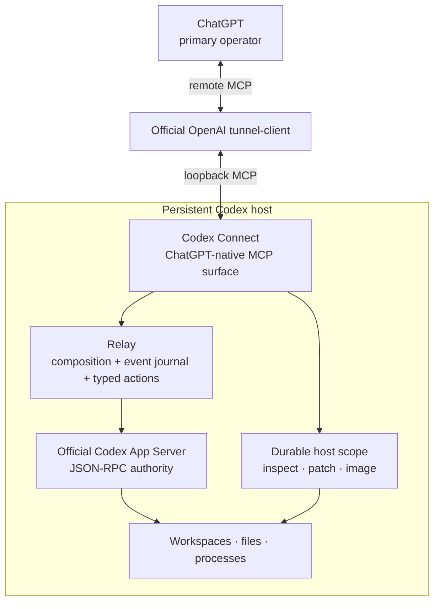
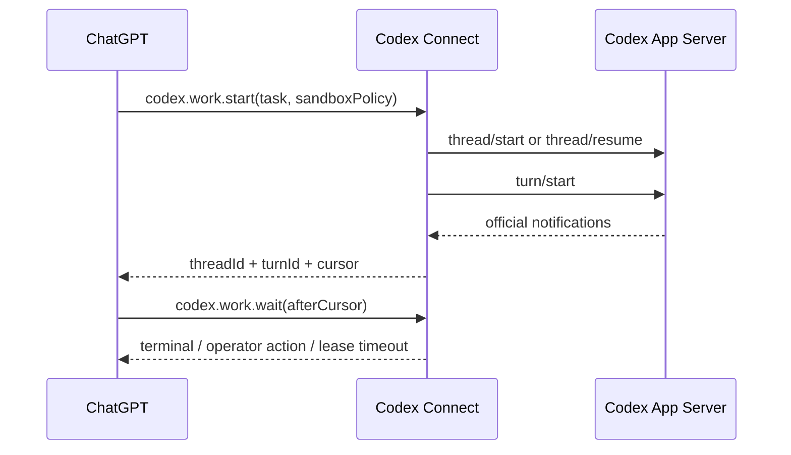

# Architecture

Codex Connect is a ChatGPT-native operator adapter over the official Codex App Server. It deliberately keeps one authority for Codex state: App Server.

## Topology



## Authority boundary

Codex Connect does **not** define another agent/session model.

- App Server owns thread and turn state.
- `codex.work.start` composes `thread/start` or `thread/resume` with `turn/start`.
- `codex.work.steer` maps to `turn/steer`.
- `codex.work.interrupt` maps to `turn/interrupt`.
- `codex.review` maps to inline `review/start`.
- Every public result preserves official App Server identifiers.

Connect-owned state is observational or transport-specific only: the bounded event journal, pending server-request registry, and bounded live-turn cache seeded from official turn-start responses/lifecycle events. None is authoritative Codex state; persisted thread history remains App Server-owned.

## App Server reuse invariant

Before adding or retaining a Codex Connect capability, inspect the generated schema from the pinned Codex CLI. If App Server already owns the semantic operation, Connect must project or adapt that method instead of implementing a parallel host primitive. A Connect-only bridge is justified only when the pinned App Server has no equivalent semantic operation required by ChatGPT.

The public surface therefore falls into three implementation classes:

| Class | Public surface | App Server authority / justification |
| --- | --- | --- |
| Projection | `codex.model.list`, `codex.skills.list`, `codex.usage` | Narrow projections of `model/list`, `skills/list`, and `account/rateLimits/read`. |
| Adapter | `command.exec`, `command.start/read/write/resize/terminate` | Official sandboxed `command/exec` and its streaming control RPCs; Connect adds scope normalization, bounded journals, and MCP lifecycle projection. |
| Adapter | `codex.work.start/read/wait/steer/interrupt` | Official `thread/*` and `turn/*` state remains authoritative; Connect composes the small operator workflow and quiet-join journal. |
| Adapter | `codex.review` | Official `review/start`, with scoped thread preparation and work-result projection. |
| Adapter | `codex.pendingActions.list` and typed responders | Official App Server server requests remain authoritative; Connect keeps only the pending-response routing needed to answer them over MCP. |
| Adapter | `inspect.readText/readDirectory/metadata/fuzzyFileSearch` | Official `fs/readFile`, `fs/readDirectory`, `fs/getMetadata`, and `fuzzyFileSearch`; Connect adds durable-scope fencing and presentation bounds. |
| Adapter | `view_image` | Image bytes come from official `fs/readFile`; Connect only validates/resizes them and emits an MCP image content block. |
| Bridge | `inspect.searchContent` | The pinned App Server has no workspace-content-search RPC. The bridge is bounded, scope-fenced, cancellation-aware, and skips known build/cache trees. |
| Bridge | `apply_patch` | The pinned App Server exposes byte-level filesystem mutations but no deterministic patch semantic RPC. Connect owns patch parsing/preflight/rollback semantics. |
| Bridge | `status` | Operator/runtime health and content-addressed build identity are Connect deployment concerns, not Codex thread state. |

`codex.*` is the public namespace for interacting with the Codex CLI/App Server agent domain. `codex-connect` remains the implementation/product identity of the bridge, while host/operator operations such as `status`, `inspect`, `apply_patch`, `view_image`, and `command.*` speak for the connector environment directly.

An upstream method is not automatically public merely because it exists. For example, the pinned App Server also exposes fuzzy-file-search session methods intended for interactive picker-style clients; ChatGPT's one-shot exploration path does not need that lifecycle, so Codex Connect exposes only the one-shot ranked search. Conversely, a bridge must be removed or reduced when a future pinned App Server version gains the equivalent semantic capability.

## Event-driven work

App Server emits turn, item, plan, diff, usage, and lifecycle notifications. The relay records a bounded recent journal with a monotonically increasing local cursor while retaining the original method and params.



`codex.work.wait` is a bounded quiet join, not a progress subscription. Routine item lifecycle notifications, tool activity, file changes, and agent commentary continue to enter the bounded event journal but do not resolve the wait. The wait returns early only when the selected turn becomes terminal or operator action/input is required; otherwise it returns when its lease expires. A zero-duration wait can be used to pull the accumulated journal without blocking. The relay treats the official `turn/start` / `review/start` response as immediately valid live state, then reconciles against paginated `thread/turns/list` history with turn items omitted during scans. Only the selected turn is hydrated through filtered `thread/items/list` pages. Metadata checks use `thread/read(includeTurns=false)`; full-history hydration is deliberately avoided on the wait path.

## Typed action loop

Operator-actionable server requests are normalized into four categories:

- command/file approvals → `codex.approval.respond`
- permission grants → `codex.permissions.respond`
- MCP elicitation → `codex.elicitation.respond`
- Codex semantic questions → `codex.userInput.respond`

The pending registry preserves the exact official request ID, method, params, and correlated thread ID. Responders validate the action category and translate the compact public decision into the pinned official response shape. Unsupported server requests fail closed.

`item/tool/requestUserInput` is the one deliberate experimental exception. It is exposed because semantic worker questions materially improve operator collaboration; all other experimental App Server methods remain private and unavailable unless separately designed into the public surface.

## Host inspection boundary

`inspect` is the single read-only host inspection primitive. It supports batched:

- `readText`
- `readDirectory`
- `metadata`
- `searchContent`
- `fuzzyFileSearch`

Each inspection request may select a `cwd` inside the durable scope. Relative operation paths resolve from that request-local directory; omitted search paths mean the selected `cwd`, and omitted `cwd` means the durable scope root. The scope root remains the authorization boundary: there is no active-project state, alternate-root retry, or path fallback. One failed inspection operation is returned as an indexed error beside successful results; malformed batches and cancellation still fail the whole request.

All resolved paths are fenced to the configured durable root before an App Server filesystem request is sent. `readText`, `readDirectory`, and `metadata` use the pinned `fs/readFile`, `fs/readDirectory`, and `fs/getMetadata` RPCs. `readText` rejects files that cannot fit safely inside the shared App Server JSONL frame before issuing `fs/readFile`, then decodes the base64 payload and applies its existing line-range presentation. `readDirectory` similarly estimates the pinned response size from entry names and rejects listings that could exceed the shared transport frame before issuing the RPC; App Server remains authoritative for the returned entry data. `fuzzyFileSearch` uses the pinned App Server RPC of the same name and preserves its ranked result contract (`root`, relative `path`, `match_type`, `file_name`, `score`, and optional `indices`) without adding synthetic limits or truncation semantics; returned roots and paths are canonicalized and any match that escapes the selected scoped root, including through descendant symlinks, is dropped. Directory and metadata results use the App Server field names; in particular, metadata has `createdAtMs`, `modifiedAtMs`, `isFile`, `isDirectory`, and `isSymlink`, and no synthetic `sizeBytes` field because the official metadata RPC does not report one.

`searchContent` remains the one native inspection bridge because the pinned App Server does not expose workspace-content search. It does not follow symlinks, skips known build/cache directories, supports cancellation, and returns an explicit truncation signal. Codex Connect deliberately does **not** maintain a second name-search implementation: ranked file/directory discovery is delegated to App Server `fuzzyFileSearch`.

`apply_patch` remains a native bridge because App Server has no patch semantic RPC. `view_image` is an adapter: file bytes are read through App Server `fs/readFile`, while Connect performs the prompt-oriented image validation/resizing and MCP image projection. Both use the same request-local `cwd` convention as inspection.

## Command boundary

`command.exec` is reserved for a known deterministic command that should finish synchronously. It is also the intended composition escape hatch for repository/tool queries that are naturally expressed as one bounded command (for example, several related `git`, `rg`, or build-system reads in one shell invocation) rather than a chain of tiny MCP calls. The default timeout is 30 seconds, callers may extend it to 60 minutes, and captured stdout/stderr remains capped rather than allowing unbounded buffering.

### Host sandbox inheritance invariant

> **Invariant:** when a host `command.exec` or `command.start` call omits `sandboxPolicy`, Codex Connect MUST send **no synthetic sandbox policy** to App Server. The `sandboxPolicy` field stays absent from the official `command/exec` request, and App Server applies the effective upstream Codex configuration it already loaded from `$CODEX_HOME/config.toml` (normally `~/.codex/config.toml`).

This makes upstream Codex configuration the single source of truth for host-command defaults. Codex Connect must not parse, copy, persist, materialize, or otherwise mirror `sandbox_mode` or `sandbox_workspace_write.network_access` as its own defaults. An explicit per-command `sandboxPolicy` is an override only and is scope-normalized before being sent upstream.

Persistent deterministic commands use a separate `command.start` / `command.read` / `command.write` / `command.resize` / `command.terminate` surface backed by the official sandboxed `command/exec` streaming session contract. `command.start` supplies a client-generated, connection-scoped `processId`, enables streamed stdout/stderr and stdin control, and runs the still-pending `command/exec` RPC in a relay task until the App Server returns its authoritative final response. PTY mode is explicit; non-PTY sessions still support streaming output and stdin. `command.read` uses a bounded per-session cursor journal and wakes on new output, terminal state, or lease expiry. Output retention and each MCP response are bounded; history loss is surfaced rather than hidden.

App Server owns the actual process lifecycle. Codex Connect owns only the bounded client-side projection required to expose that long-running RPC asynchronously over MCP. There is deliberately no `command.list`: the pinned App Server has no authoritative standalone command-session enumeration RPC, so exposing relay bookkeeping as a list would imply authority it does not have. Command-session handles do not survive backend/App Server restart. The pinned protocol states that streaming command sessions are connection-scoped and are terminated if the originating connection closes; after restart an old `processId` is therefore stale and rejected.

The separate experimental App Server `process/*` API is not used for this surface because current upstream semantics place it outside Codex sandbox execution, while the operator contract here requires the existing sandbox/network controls. Autonomous investigation or coding still belongs in `codex.work.start`, where Codex owns its normal command/file lifecycle and reasoning loop. Every public `codex.work.start` call requires `sandboxPolicy`; Codex Connect roots workspace-write paths and always sends that operator-selected policy on the corresponding official `turn/start`. The lower-level App Server protocol keeps the field optional because that is the pinned upstream wire contract, but the public operator surface intentionally does not inherit it.

Workspace-write `writableRoots` must be absolute paths inside the durable scope. For an explicitly supplied policy, the upstream `networkAccess` boolean is passed through deliberately: `false` can prohibit socket creation, including localhost-based tests, while `true` is broader network access rather than a loopback-only grant. Codex Connect does not silently retry with broader permissions.

Setup sanitizes its execution `PATH` to absolute, non-empty directories and embeds that PATH in the persistent user-systemd backend unit. This gives App Server commands and workers the operator toolchain environment without wrapping commands in login shells or adding executable-specific lookup fallbacks.

## Protocol boundary

The App Server handshake explicitly sets:

```text
experimentalApi = true
requestAttestation = false
extensions["openai/form"] = {}
```

The dedicated pinned App Server process is launched with `default_mode_request_user_input`, `request_permissions_tool`, and `exec_permission_approvals` enabled. Codex Connect owns these process-local requirements rather than depending on a user's global Codex feature configuration.

Because `openai/form` is advertised during initialization, the elicitation responder accepts both standard `form` payloads and the `openai/form` / legacy `openaiForm` variants. URL-mode elicitation remains content-free on acceptance.

`codex.usage` preserves the pinned App Server account usage payload rather than projecting only percentages. This includes `ordinaryUsageAllowed`, reset-credit summary state, per-limit snapshots, and other top-level fields supplied by `account/rateLimits/read`, so the operator does not infer availability from percentages or reset timestamps.

The generated schema artifact contains only the internal requests and server-response contracts needed by the adapter, including the explicitly selected user-input request contract. Upstream App Server schema identifiers are preserved verbatim and do not define generations of the Codex Connect MCP surface. Adding an App Server method to that artifact does not make it a public MCP tool; public tools are deliberately designed around ChatGPT goals.

## Durable host scope

The backend has one durable host scope root, defaulting to `~/projects`. Project selection remains per operation through paths or official `cwd` fields. There is no active-project backend setting.

The durable root is workspace-oriented rather than repository-oriented. Git or another VCS may exist inside a workspace, but Codex Connect does not require one and agents must not introduce version-control workflow unless the operator explicitly requests it.

Path fencing is not a machine-wide sandbox. Commands, network access, `dangerFullAccess`, and `sudo` remain subject to Codex sandbox policy and the host user's OS permissions. See [Security](../../SECURITY.md).

## Runtime ownership

Codex Connect owns only its backend process. The official tunnel client owns tunnel credentials, profile state, reconnection, and lifecycle. Restarting or deploying Codex Connect must not recreate or supervise the tunnel runtime.

Deployment uses one durable operation id across an explicit prepare/status/activate/status transaction. `prepare` persists `building` and returns after handing compilation to a detached systemd job; that job eventually records the content-addressed artifact as `prepared` or records `failed`. Operation-scoped file locking serializes readers and state-changing activation requests. `activate` durably records `activationQueued`, hands a delayed detached job to systemd, and returns before that job restarts the backend; failed handoff restores `prepared`. The durable phases are `building`, `prepared`, `activationQueued`, `activating`, `succeeded`, and `failed`. Status reconciles an unexpectedly vanished detached job instead of leaving an operation permanently pending, and post-reconnect success is verified against the exact prepared SHA-256. Installed content-addressed artifacts are not automatically pruned because another durable prepared operation may still reference them. This keeps both long compilation and backend self-restart outside foreground operator-command lifetimes.
