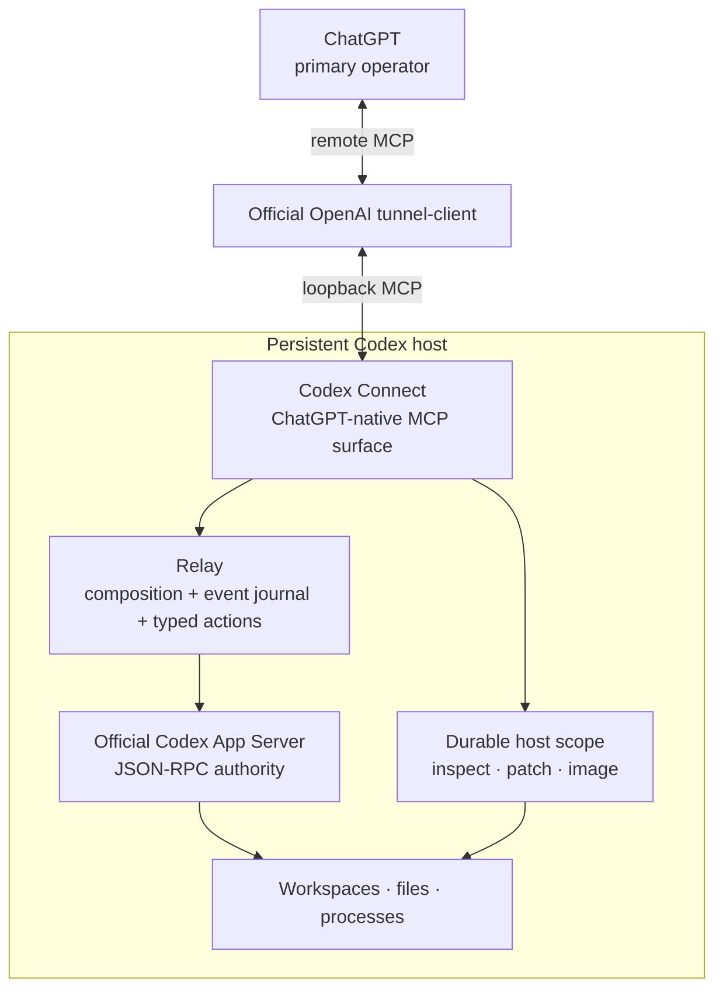
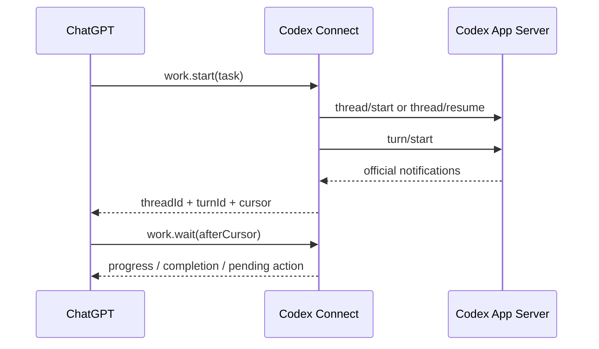

# Architecture

Codex Connect is a ChatGPT-native operator adapter over the official Codex App Server. It deliberately keeps one authority for Codex state: App Server.

## Topology



## Authority boundary

Codex Connect does **not** define another agent/session model.

- App Server owns thread and turn state.
- `work.start` composes `thread/start` or `thread/resume` with `turn/start`.
- `work.steer` maps to `turn/steer`.
- `work.interrupt` maps to `turn/interrupt`.
- `review` maps to inline `review/start`.
- Every public result preserves official App Server identifiers.

Connect-owned state is observational or transport-specific only: the bounded event journal and pending server-request registry. Neither is authoritative Codex state.

## Event-driven work

App Server emits turn, item, plan, diff, usage, and lifecycle notifications. The relay records a bounded recent journal with a monotonically increasing local cursor while retaining the original method and params.



`work.wait` is bounded. It does not create a second scheduler or poll experimental App Server pagination APIs.

## Typed action loop

Operator-actionable server requests are normalized into four categories:

- command/file approvals → `codexConnect.approval.respond`
- permission grants → `codexConnect.permissions.respond`
- MCP elicitation → `codexConnect.elicitation.respond`
- Codex semantic questions → `codexConnect.userInput.respond`

The pending registry preserves the exact official request ID, method, params, and correlated thread ID. Responders validate the action category and translate the compact public decision into the pinned official response shape. Unsupported server requests fail closed.

`item/tool/requestUserInput` is the one deliberate experimental exception. It is exposed because semantic worker questions materially improve operator collaboration; all other experimental App Server methods remain private and unavailable unless separately designed into the public surface.

## Host inspection boundary

`codexConnect.inspect` is the single read-only host inspection primitive. It supports batched:

- `readText`
- `readDirectory`
- `metadata`
- `searchContent`
- `searchNames`

All paths are fenced to the configured durable root. Text reads require UTF-8, content/name search does not follow symlinks, and build/cache directories are skipped where appropriate.

`apply_patch` and `view_image` remain native host primitives because their content semantics are more useful to ChatGPT than byte-oriented filesystem RPCs.

## Command boundary

`command.exec` is reserved for a known deterministic command. Interactive PTY continuation is intentionally absent from the MCP surface. Autonomous investigation or coding belongs in `work.start`, where Codex owns its normal command/file lifecycle and approval flow.

## Protocol boundary

The App Server handshake explicitly sets:

```text
experimentalApi = true
requestAttestation = false
```

The generated schema artifact contains only the internal requests and server-response contracts needed by the adapter, including the explicitly selected user-input request contract. Upstream App Server schema identifiers are preserved verbatim and do not define generations of the Codex Connect MCP surface. Adding an App Server method to that artifact does not make it a public MCP tool; public tools are deliberately designed around ChatGPT goals.

## Durable host scope

The backend has one durable host scope root, defaulting to `~/projects`. Project selection remains per operation through paths or official `cwd` fields. There is no active-project backend setting.

The durable root is workspace-oriented rather than repository-oriented. Git or another VCS may exist inside a workspace, but Codex Connect does not require one and agents must not introduce version-control workflow unless the operator explicitly requests it.

Path fencing is not a machine-wide sandbox. Commands, network access, `dangerFullAccess`, and `sudo` remain subject to Codex sandbox policy and the host user's OS permissions. See [Security](../../SECURITY.md).

## Runtime ownership

Codex Connect owns only its backend process. The official tunnel client owns tunnel credentials, profile state, reconnection, and lifecycle. Restarting or deploying Codex Connect must not recreate or supervise the tunnel runtime.
