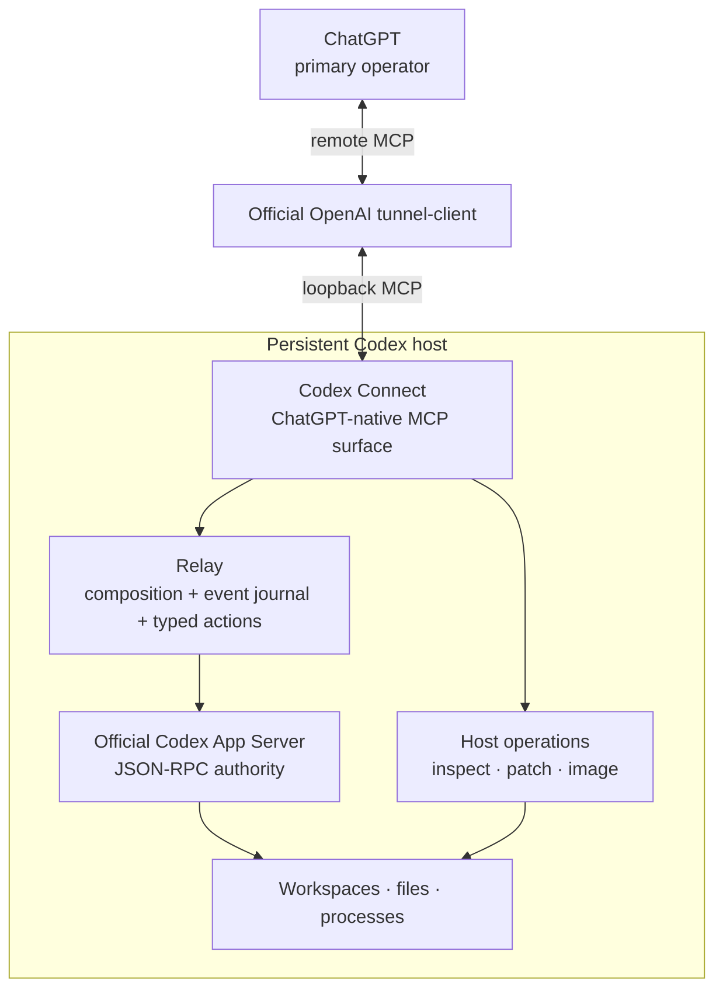
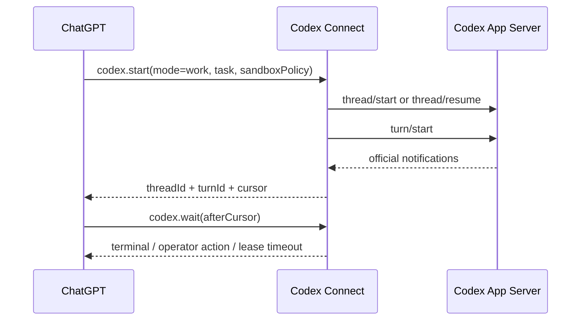

# Architecture

Codex Connect is the bridge from ChatGPT to a persistent host workspace and the official Codex App Server. It deliberately keeps one authority for Codex state: App Server.

## Topology


```mermaid
flowchart TD
    CHAT[ChatGPT<br/>primary operator]
    TUNNEL[Official OpenAI tunnel-client]

    subgraph HOST[Persistent Codex host]
        MCP[Codex Connect<br/>ChatGPT-native MCP surface]
        ADAPTER[Relay<br/>composition + event journal + typed actions]
        APP[Official Codex App Server<br/>JSON-RPC authority]
        HOSTOPS[Host operations<br/>inspect · patch · image]
        STATE[Workspaces · files · processes]

        MCP --> ADAPTER
        MCP --> HOSTOPS
        ADAPTER --> APP
        APP --> STATE
        HOSTOPS --> STATE
    end

    CHAT <-->|remote MCP| TUNNEL
    TUNNEL <-->|loopback MCP| MCP
```

## Authority boundary

Codex Connect does **not** define another agent/session model.

- App Server owns thread and turn state.
- `codex.start(mode=work)` composes `thread/start` or `thread/resume` with `turn/start`.
- `codex.start(mode=review)` maps to inline `review/start`.
- `codex.control(action=steer|interrupt)` maps to `turn/steer` / `turn/interrupt`.
- `codex.wait` projects official turn state plus the bounded event journal and pending requests; `timeoutMs=0` is the snapshot path.
- Every public result preserves official App Server identifiers.

Connect-owned state is observational or transport-specific only: the bounded event journal, pending server-request registry, and bounded live-turn cache seeded from official turn-start responses/lifecycle events. None is authoritative Codex state; persisted thread history remains App Server-owned.

The backend also exposes loopback-only runtime/observer endpoints for local management and the `codex-connect console`. They are deliberately outside the public MCP tool catalog. Internal runtime status retains deployment and diagnostic provenance such as the exact binary SHA-256 and App Server launch context, while `/observe` adds briefly cached `account/rateLimits/read` telemetry, currently active entries from the bounded live-turn cache, pending-action metadata, and the newest bounded journal events. For turns initiated through the relay, the projection also retains the requested mode/model/reasoning-effort/service-tier metadata because upstream `Turn` lifecycle objects do not carry those fields; lifecycle updates preserve this metadata without promoting it to authoritative Codex state. The projection resets with the backend process and must not be interpreted as global Codex thread enumeration.

## App Server reuse invariant

Before adding or retaining a Codex Connect capability, inspect the generated schema from the pinned Codex CLI. If App Server already owns the semantic operation, Connect must project or adapt that method instead of implementing a parallel host primitive. A Connect-only bridge is justified only when the pinned App Server has no equivalent semantic operation required by ChatGPT.

The public surface therefore falls into three implementation classes:

| Class | Public surface | App Server authority / justification |
| --- | --- | --- |
| Projection | `codex.info` | Batched narrow projections of `model/list`, `skills/list`, and `account/rateLimits/read`. |
| Adapter | `command.exec`, `command.start/read/control` | Official sandboxed `command/exec` and its streaming write/resize/terminate RPCs; Connect adds default-cwd resolution, bounded journals, and MCP lifecycle projection. |
| Adapter | `codex.start/wait/control` | Official `thread/*`, `turn/*`, and `review/start` state remains authoritative; Connect composes one start/read-control workflow and quiet-join journal. |
| Adapter | `codex.action.respond` | Official approval, permission, and user-input server requests remain authoritative; Connect keeps only the pending-response routing needed to answer these three public collaboration categories over MCP. |
| Adapter | `inspect.readText/readDirectory/metadata/fuzzyFileSearch` | Official `fs/readFile`, `fs/readDirectory`, `fs/getMetadata`, and `fuzzyFileSearch`; Connect adds request-path resolution, transport preflight, and presentation bounds. |
| Adapter | `view_image` | Image bytes come from official `fs/readFile`; Connect only validates/resizes them and emits an MCP image content block. |
| Bridge | `inspect.searchContent` | The pinned App Server has no workspace-content-search RPC. The bridge is bounded, cancellation-aware, does not follow symlinks, and skips known build/cache trees. |
| Bridge | `apply_patch` | The pinned App Server exposes byte-level filesystem mutations but no deterministic patch semantic RPC. Connect owns patch parsing/preflight/rollback semantics. |
| Bridge | `status` | Compact operator orientation: readiness, live build identity, navigation cwd, and worker-default values/provenance. Detailed deployment/App Server provenance remains on the loopback management plane rather than the public MCP surface. |

The local observer endpoint and console do not add an MCP tool or a second control plane. They are a presentation-only projection over the same relay process; approval, permission, user-input, delegation, steering, and interruption authority remain on the existing ChatGPT-facing MCP path.

`codex.*` is the public namespace for interacting with the Codex CLI/App Server agent domain. `codex-connect` remains the implementation/product identity of the bridge, while host/operator operations such as `status`, `inspect`, `apply_patch`, `view_image`, and `command.*` speak for the connector environment directly.

An upstream method is not automatically public merely because it exists. For example, the pinned App Server also exposes fuzzy-file-search session methods intended for interactive picker-style clients; ChatGPT's one-shot exploration path does not need that lifecycle, so Codex Connect exposes only the one-shot ranked search. Conversely, a bridge must be removed or reduced when a future pinned App Server version gains the equivalent semantic capability.

## Event-driven work

App Server emits turn, item, plan, diff, usage, and lifecycle notifications. The relay records a bounded recent journal with a monotonically increasing local cursor while retaining the original method and params.


```mermaid
sequenceDiagram
    participant C as ChatGPT
    participant X as Codex Connect
    participant A as Codex App Server

    C->>X: codex.start(mode=work, task, sandboxPolicy)
    X->>A: thread/start or thread/resume
    X->>A: turn/start
    A-->>X: official notifications
    X-->>C: threadId + turnId + cursor
    C->>X: codex.wait(afterCursor)
    X-->>C: terminal / operator action / lease timeout
```

`codex.wait` is a bounded quiet join, not a progress subscription. Routine item lifecycle notifications, tool activity, file changes, and agent commentary continue to enter the bounded event journal but do not resolve the wait. The wait returns early only when the selected turn becomes terminal or operator action/input is required; otherwise it returns when its lease expires. Lease expiry never interrupts the underlying Codex turn; long-running work is observed through repeated bounded joins. A zero-duration wait is the authoritative snapshot path and replaces a separate read tool. The relay treats the official `turn/start` / `review/start` response as immediately valid live state, then reconciles against paginated `thread/turns/list` history with turn items omitted during scans. Periodic reconciliation is status-only; `thread/items/list` is used only when an authoritative terminal turn needs its final output materialized. For turns already represented in the live projection, positive wait leases bound initial and periodic status reconciliation. A zero-duration snapshot or a turn that predates the current relay process may still require the minimum authoritative read needed to establish trustworthy state, and terminal output hydration remains a separate bounded App Server operation. `timeoutMs` is therefore the operator join lease, not a promise that the complete MCP response lifecycle has no other bounded work. Metadata checks use `thread/read(includeTurns=false)`; full-history hydration is deliberately avoided on the wait path.

## Typed action loop

Public operator-actionable server requests are normalized into four categories and resolved through `codex.action.respond`:

- command/file approvals → `type=approval`
- permission grants → `type=permissions`
- Codex semantic questions → `type=userInput`
- MCP form/URL elicitation → `type=elicitation`

The pending registry preserves the exact official request ID, method, params, and correlated thread ID. `codex.wait` returns those pending actions directly, eliminating a separate list tool. The responder validates the action category against the authoritative request kind and translates the compact public decision into the pinned official response shape. `openai/form` is advertised through the App Server initialize extension map; elicitation reuses the same typed responder, so the minimized MCP tool surface does not grow.

`item/tool/requestUserInput` is the one deliberate experimental exception. It is exposed because semantic worker questions materially improve operator collaboration; all other experimental App Server methods remain private and unavailable unless separately designed into the public surface.

## Host inspection plane

`inspect` is the single read-only host inspection primitive. It supports batched:

- `readText`
- `readDirectory`
- `metadata`
- `searchContent`
- `fuzzyFileSearch`

Each inspection request may select a host `cwd`. Relative operation paths resolve from that request-local directory; omitted search paths mean the selected `cwd`, and omitted `cwd` means the configured navigation cwd. Absolute host paths are accepted. The configured cwd is a navigation default, not an authorization boundary. One failed inspection operation is returned as an indexed error beside successful results; malformed batches and cancellation still fail the whole request.

`readText`, `readDirectory`, and `metadata` use the pinned `fs/readFile`, `fs/readDirectory`, and `fs/getMetadata` RPCs. `readText` rejects files that cannot fit safely inside the shared App Server JSONL frame before issuing `fs/readFile`, then decodes the base64 payload and applies its existing line-range presentation. `readDirectory` similarly estimates the pinned response size from entry names and rejects listings that could exceed the shared transport frame before issuing the RPC; App Server remains authoritative for the returned entry data. `fuzzyFileSearch` uses the pinned App Server RPC of the same name and preserves its ranked result contract (`root`, relative `path`, `match_type`, `file_name`, `score`, and optional `indices`) without adding synthetic limits or truncation semantics. Returned fuzzy matches are still checked against the selected search root so descendant symlink escapes are dropped. Directory and metadata results use the App Server field names; in particular, metadata has `createdAtMs`, `modifiedAtMs`, `isFile`, `isDirectory`, and `isSymlink`, and no synthetic `sizeBytes` field because the official metadata RPC does not report one.

`searchContent` remains the one native inspection bridge because the pinned App Server does not expose workspace-content search. It does not follow symlinks, skips known build/cache directories, supports cancellation, and returns an explicit truncation signal. Codex Connect deliberately does **not** maintain a second name-search implementation: ranked file/directory discovery is delegated to App Server `fuzzyFileSearch`.

The public `inspect` output schema preserves that operation type information instead of collapsing successful rows to an opaque object. Each success variant has the concrete response shape for `readText`, `readDirectory`, `metadata`, `searchContent`, or `fuzzyFileSearch`, while failed sibling operations retain the indexed `{type,error}` form. This is schema/presentation typing only; it does not add a second implementation of any App Server filesystem method.

`apply_patch` remains a native bridge because App Server has no patch semantic RPC. `view_image` is an adapter: file bytes are read through App Server `fs/readFile`, while Connect performs the prompt-oriented image validation/resizing and MCP image projection. Both use the same request-local `cwd` convention as inspection.

## Command boundary

`command.exec` is reserved for a known deterministic command that should finish synchronously. It is also the intended composition escape hatch for repository/tool queries that are naturally expressed as one bounded command (for example, several related `git`, `rg`, or build-system reads in one shell invocation) rather than a chain of tiny MCP calls. The default process timeout is 60 seconds, callers may extend it to 60 minutes, and captured stdout/stderr remains capped rather than allowing unbounded buffering. `timeoutMs` is an App Server process deadline, not an end-to-end MCP latency SLA: Codex Connect gives final response delivery a small finite allowance after that deadline. The pinned App Server buffered response contains `exitCode`, `stdout`, and `stderr` but no truncation flag. Connect therefore adds byte counts plus conservative `stdoutMayBeTruncated` / `stderrMayBeTruncated` flags when a stream exactly reaches `outputBytesCap`; those flags mean the cap may have been reached, not that truncation is proven. `durationMs` is Connect-observed wall time for the App Server command request.

### Primary-operator authority invariant

> **Invariant:** public host `command.exec` and `command.start` expose no sandbox selector. Codex Connect launches its dedicated App Server with `sandbox_mode="danger-full-access"`, so deterministic host operations have the authority of the backend OS account.

This is a Codex Connect process-local launch invariant, not a user-global Codex default. `~/.codex/config.toml` remains upstream-owned and generic. Host `cwd` chooses process location only; it does not reduce host authority. The loopback/tunnel ingress boundary is therefore security-critical.

Persistent deterministic commands use `command.start` / `command.read` / `command.control`, backed by the official sandboxed `command/exec` streaming session contract. `command.start` supplies a client-generated, connection-scoped `processId`, enables streamed stdout/stderr and stdin control, and runs the still-pending `command/exec` RPC in a relay task until the App Server returns its authoritative final response. `command.control` discriminates write, resize, and terminate mutations against that same session. PTY mode is explicit; non-PTY sessions still support streaming output and stdin. `command.read` uses a bounded per-session cursor journal and wakes on new output, terminal state, or lease expiry. Process lifecycle and journal consumption are independent: a read can report `state:"exited"` or `state:"failed"` while newer retained chunks remain unread because each MCP response is separately bounded. `hasMoreOutput:true` states that a newer retained chunk was withheld by that response bound. `drained:true` states that the process is terminal and the current read consumed all retained output, so no cursor-stability inference is required. Output retention is separately bounded; `historyLost:true` still means older journal data is no longer recoverable even when `drained:true`.

`command.control(action=terminate)` forwards the official App Server stop request and does not add a graceful-shutdown contract. Runtime/platform termination may prevent shell traps or other cleanup handlers from running; callers must not depend on them and must use `command.read` for the authoritative final state and any retained output.

App Server owns the actual process lifecycle. Codex Connect owns only the bounded client-side projection required to expose that long-running RPC asynchronously over MCP. There is deliberately no `command.list`: the pinned App Server has no authoritative standalone command-session enumeration RPC, so exposing relay bookkeeping as a list would imply authority it does not have. Command-session handles do not survive backend/App Server restart. The pinned protocol states that streaming command sessions are connection-scoped and are terminated if the originating connection closes; after restart an old `processId` is therefore stale and rejected.

The separate experimental App Server `process/*` API is not used for this surface. Autonomous investigation or coding belongs in `codex.start(mode=work)` only when delegation materially improves the critical path or quality; Codex owns the delegated command/file lifecycle and reasoning loop. Every work-mode start requires `sandboxPolicy`; Codex Connect sends that exact operator-selected policy on the corresponding official `turn/start` and fixes `approvalPolicy` to `on-request` rather than exposing another operator knob. The mandatory worker policy directs Codex to remain inside the granted sandbox, try sandbox-safe alternatives first, and request additional authority only for a concrete blocker. For a new work thread Connect also sends the matching coarse `thread/start.sandbox` value, preventing thread initialization from inheriting the host-plane `danger-full-access` default. New work threads may additionally supply `developerInstructions`; Codex Connect appends them after its mandatory `WORKSPACE_POLICY` and rejects that field when `threadId` resumes an existing thread. Resume omits a developer-instruction override so the thread retains the instruction set established at creation. The lower-level App Server protocol keeps the turn field optional because that is the pinned upstream wire contract, but the public operator surface intentionally does not inherit it. Delegated workers do not inherit the calling ChatGPT conversation, so the task payload remains self-contained even when developer instructions carry the worker's operating contract.

Delegation is asynchronous from the operator's perspective. The relay keeps a bounded internal operator inbox containing only semantic worker interrupts: terminal work/review turns and pending approval, permission, elicitation, or semantic-input actions. Successful host-plane MCP responses may include up to eight unread `workerEvents`; ordinary worker tool calls and commentary remain only in the observer/event journal. Events are delivered once, and `codex.wait` remains the authoritative detailed join. This lets ChatGPT keep working independently without a separate polling/status tool while the console retains the richer live projection.

App Server thread subscriptions are connection-scoped runtime ownership, not durable thread storage. Codex Connect subscribes through `thread/start` / `thread/resume` and releases that subscription with `thread/unsubscribe` after a delegated work/review turn is terminal and no other nonterminal delegated turn remains on the same thread. Terminal release is observed both from lifecycle notifications and from authoritative `codex.wait` reconciliation so a missed notification cannot retain an otherwise idle thread runtime. Unsubscribe is best-effort and idempotent from the relay's perspective: a teardown race must not turn an already-terminal worker result into an operator error. The observer journal records `codexConnect/threadUnsubscribed` with the upstream status on success and `codexConnect/threadUnsubscribeFailed` on transport/RPC failure. Persisted threads remain resumable through the normal `thread/resume` path.

Workspace-write `writableRoots` must be absolute host paths. They are additional writable roots in the upstream delegated-work policy, not an exclusive allowlist. Delegated work may explicitly select `readOnly`, `workspaceWrite`, or `dangerFullAccess`; the upstream `networkAccess` boolean is passed through deliberately, and Codex Connect does not silently retry with broader permissions. New `codex.start(mode=review)` threads are always started with coarse `read-only`; an optional `model` is carried on `thread/start`, while the official `review/start` request remains unchanged. Supplying both an existing `threadId` and a new review model is rejected rather than silently mutating thread state.

Setup sanitizes its execution `PATH` to absolute, non-empty directories and embeds that PATH in the persistent user-systemd backend unit. This gives App Server commands and workers the operator toolchain environment without wrapping commands in login shells or adding executable-specific lookup fallbacks.

## Protocol boundary

The App Server handshake explicitly sets:

```text
experimentalApi = true
requestAttestation = false
extensions = { "openai/form" = {} }
```

The dedicated pinned App Server process is launched with `sandbox_mode="danger-full-access"` plus `default_mode_request_user_input`, `request_permissions_tool`, and `exec_permission_approvals`. Codex Connect owns these process-local requirements rather than depending on a user's global Codex configuration.

Codex Connect advertises `openai/form` through the canonical App Server extension map and answers `mcpServer/elicitation/request` through `codex.action.respond`. The legacy `mcpServerOpenaiFormElicitation` boolean is not advertised.

`codex.info(type=usage)` preserves the pinned App Server account usage payload rather than projecting only percentages. This includes `ordinaryUsageAllowed`, reset-credit summary state, per-limit snapshots, and other top-level fields supplied by `account/rateLimits/read`, so the operator does not infer availability from percentages or reset timestamps.

The generated schema artifact contains only the internal requests and server-response contracts needed by the adapter, including the explicitly selected user-input request contract. Upstream App Server schema identifiers are preserved verbatim and do not define generations of the Codex Connect MCP surface. Adding an App Server method to that artifact does not make it a public MCP tool; public tools are deliberately designed around ChatGPT goals.

## Navigation cwd

The backend has one configured default working directory, defaulting to `~/projects`. It is the base for relative paths and the App Server startup directory, not an authorization boundary. Project selection remains per operation through paths or official `cwd` fields. There is no active-project backend setting.

The default directory is workspace-oriented rather than repository-oriented. Git or another VCS may exist there, but Codex Connect does not require one and agents must not introduce version-control workflow unless the operator explicitly requests it.

Host-plane authority is intentionally machine-wide within the backend OS account; delegated Codex turns remain separately bounded by their explicit policy. See [Security](../../SECURITY.md).

## Runtime ownership

Codex Connect is downstream of both Codex CLI/App Server and Secure MCP Tunnel. Those are user-global upstream dependencies, not components of the Codex Connect workspace installation.

- Codex CLI/App Server owns Codex execution/session semantics and Codex-owned state/configuration. Codex Connect may launch the configured global CLI but must not install, relocate, duplicate, upgrade, or delete it or its `~/.codex` state.
- The official `tunnel-client` owns its executable installation, credentials, profiles, native runtime state, reconnection, and lifecycle. Its owned paths remain outside `~/projects` (normally `~/.config/tunnel-client` and `~/.local/state/tunnel-client`). Codex Connect must not install, relocate, duplicate, upgrade, delete, recreate, or supervise the tunnel runtime.
- Codex Connect owns only its own backend process, workspace-scoped configuration/deployment state, and installed backend artifacts.

Restarting, deploying, setting up, or uninstalling Codex Connect must therefore leave both upstream dependency installations and their owned state intact.

Deployment uses one durable operation id across an explicit prepare/status/activate/status transaction. `prepare` persists `building` and returns after handing compilation to a detached systemd job; that job eventually records the content-addressed artifact as `prepared` or records `failed`. Operation-scoped file locking serializes readers and state-changing activation requests. `activate` durably records `activationQueued`, hands a delayed detached job to systemd, and returns before that job restarts the backend; failed handoff restores `prepared`. The durable phases are `building`, `prepared`, `activationQueued`, `activating`, `succeeded`, and `failed`. Status reconciles an unexpectedly vanished detached job instead of leaving an operation permanently pending, and post-reconnect success is verified against the exact prepared SHA-256. Installed content-addressed artifacts are not automatically pruned because another durable prepared operation may still reference them. This keeps both long compilation and backend self-restart outside foreground operator-command lifetimes.
