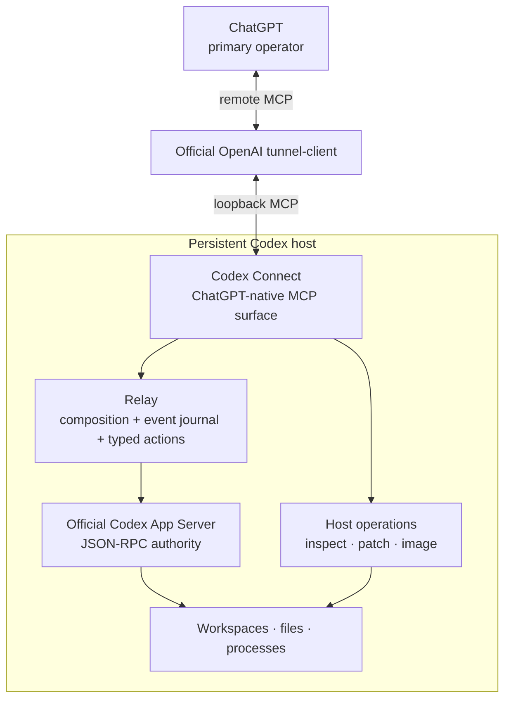
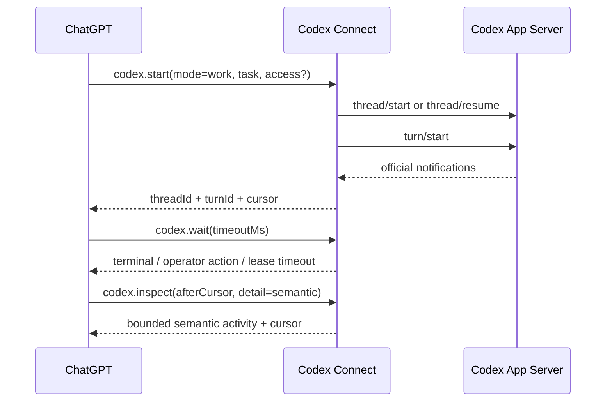

# Architecture

Codex Connect is the bridge from ChatGPT to a persistent host workspace and the official Codex App Server. It deliberately keeps one authority for Codex state: App Server.

## Topology


```mermaid
flowchart TD
    CHAT[ChatGPT<br/>primary operator]
    TUNNEL[Official OpenAI tunnel-client]

    subgraph HOST[Persistent Codex host]
        MCP[Codex Connect<br/>ChatGPT-native MCP surface]
        ADAPTER[Relay<br/>composition + event journal + typed actions]
        APP[Official Codex App Server<br/>JSON-RPC authority]
        HOSTOPS[Host operations<br/>inspect · patch · image]
        STATE[Workspaces · files · processes]

        MCP --> ADAPTER
        MCP --> HOSTOPS
        ADAPTER --> APP
        APP --> STATE
        HOSTOPS --> STATE
    end

    CHAT <-->|remote MCP| TUNNEL
    TUNNEL <-->|loopback MCP| MCP
```

## Authority boundary

Codex Connect does **not** define another agent/session model.

- App Server owns thread and turn state.
- `codex.start(mode=work)` composes `thread/start` or `thread/resume` with `turn/start`.
- `codex.start(mode=review)` maps to inline `review/start`.
- `codex.control(action=steer|interrupt)` maps to `turn/steer` / `turn/interrupt`.
- `codex.wait` is synchronization-only: it projects official turn state, current semantic activity, and pending requests while quietly joining the selected turn.
- `codex.inspect` is observation-only: it reads bounded semantic activity by default and exposes original App Server journal events only when `detail=raw` is explicitly requested.
- Every public result preserves official App Server identifiers.

Connect-owned state is observational or transport-specific only: the bounded raw event journal, canonical semantic activity reducer, pending server-request registry, and bounded live-turn cache seeded from official turn-start responses/lifecycle events. None is authoritative Codex state; persisted thread history remains App Server-owned.

The backend also exposes loopback-only runtime/observer endpoints for local management and the `codex-connect console`. They are deliberately outside the public MCP tool catalog. Internal runtime status retains deployment and diagnostic provenance such as the exact binary SHA-256 and App Server launch context. `/observe` is a human-console projection: it combines briefly cached `account/rateLimits/read` telemetry with annotated active workers, a bounded set of recent terminal workers ordered by terminal recency, pending-action metadata, and a tiny system-notice stream reserved for observer/runtime lifecycle signals. It intentionally does not expose the general semantic event journal. For turns initiated through the relay, the observer retains a bounded presentation excerpt of the delegated task plus requested mode/model/reasoning effort because upstream lifecycle `Turn` objects do not carry those fields. Server-owned policy details are not duplicated into observer state. This metadata remains observational and resets with the backend process.

`/observe/transcript/{threadId}/{turnId}` materializes App Server-owned turn history only when the human console explicitly opens a worker. The observer scans newest-first and projects only human-relevant user/agent messages, so verbose command, filesystem, search, MCP-tool, and reasoning items cannot consume the transcript budget ahead of the final response. Current agent-message deltas are retained separately as a bounded coherent live-message projection, while active reasoning is represented only as a phase/state signal and never as reasoning text. Pending approvals, permissions, semantic user input, and elicitations are attached to the affected worker view with their original request context. None of this creates control authority: the console remains non-actuating, and `codex.inspect` remains the explicit semantic/raw forensics surface.

## App Server reuse invariant

Before adding or retaining a Codex Connect capability, inspect the generated schema from the pinned Codex CLI. If App Server already owns the semantic operation, Connect must project or adapt that method instead of implementing a parallel host primitive. A Connect-only bridge is justified only when the pinned App Server has no equivalent semantic operation required by ChatGPT.

The public surface therefore falls into three implementation classes:

| Class | Public surface | App Server authority / justification |
| --- | --- | --- |
| Projection | `codex.info` | Batched narrow projections of `model/list`, `skills/list`, and `account/rateLimits/read`. |
| Adapter | `command.exec`, `command.start/read/control` | Official sandboxed `command/exec` and its streaming write/resize/terminate RPCs; Connect adds default-cwd resolution, bounded journals, and MCP lifecycle projection. |
| Adapter | `codex.start/wait/inspect/control` | Official `thread/*`, `turn/*`, and `review/start` state remains authoritative; Connect composes delegation, synchronization, bounded observation, and control without exposing an alternate agent/session model. |
| Adapter | `codex.action.respond` | Official approval, permission, and user-input server requests remain authoritative; Connect keeps only the pending-response routing needed to answer these three public collaboration categories over MCP. |
| Adapter | `inspect.readText/readDirectory/metadata/fuzzyFileSearch` | Official `fs/readFile`, `fs/readDirectory`, `fs/getMetadata`, and `fuzzyFileSearch`; Connect adds request-path resolution, transport preflight, and presentation bounds. |
| Adapter | `view_image` | Image bytes come from official `fs/readFile`; Connect only validates/resizes them and emits an MCP image content block. |
| Bridge | `inspect.searchContent` | The pinned App Server has no workspace-content-search RPC. The bridge is bounded, cancellation-aware, does not follow symlinks, and skips known build/cache trees. |
| Bridge | `apply_patch` | The pinned App Server exposes byte-level filesystem mutations but no deterministic patch semantic RPC. Connect owns patch parsing/preflight/rollback semantics. |
| Bridge | `status` | Compact operator orientation: readiness, live build identity, navigation cwd, and worker-default values/provenance. Detailed deployment/App Server provenance remains on the loopback management plane rather than the public MCP surface. |

The local observer endpoint and console do not add an MCP tool or a second control plane. They are a presentation-only projection over the same relay process; approval, permission, user-input, delegation, steering, and interruption authority remain on the existing ChatGPT-facing MCP path.

`codex.*` is the public namespace for interacting with the Codex CLI/App Server agent domain. `codex-connect` remains the implementation/product identity of the bridge, while host/operator operations such as `status`, `inspect`, `apply_patch`, `view_image`, and `command.*` speak for the connector environment directly.

### Operator execution domains

The public MCP contract deliberately distinguishes the Codex Connect host from ChatGPT's native execution surfaces. A path visible to ChatGPT's native file/runtime tooling (for example `/mnt/data` or an uploaded/Project file handle) is not implicitly a path on the Codex Connect host, and a host path returned by `inspect` or `command.*` is not implicitly available to ChatGPT-native tools. Browser/plugin state and connected-account authority are likewise not inherited by the host or by delegated Codex workers. Crossing these domains must therefore be explicit: read or materialize content from the owning surface, then deliberately pass the needed content or write it into the destination surface.

This distinction is routing guidance, not an extra authorization mechanism. Host `cwd` remains navigation only, host tools keep primary-operator host authority, and delegated Codex turns keep their explicit per-task sandbox. The MCP server instructions repeat only these cross-tool invariants; individual lifecycle, timeout, cursor, and argument semantics live on the tool/parameter metadata that owns them.

An upstream method is not automatically public merely because it exists. For example, the pinned App Server also exposes fuzzy-file-search session methods intended for interactive picker-style clients; ChatGPT's one-shot exploration path does not need that lifecycle, so Codex Connect exposes only the one-shot ranked search. Conversely, a bridge must be removed or reduced when a future pinned App Server version gains the equivalent semantic capability.

## Event-driven work

App Server emits turn, item, plan, diff, usage, and lifecycle notifications. The relay records a bounded recent journal with a monotonically increasing local cursor while retaining the original method and params.


```mermaid
sequenceDiagram
    participant C as ChatGPT
    participant X as Codex Connect
    participant A as Codex App Server

    C->>X: codex.start(mode=work, task, access?)
    X->>A: thread/start or thread/resume
    X->>A: turn/start
    A-->>X: official notifications
    X-->>C: threadId + turnId + cursor
    C->>X: codex.wait(timeoutMs)
    X-->>C: terminal / operator action / lease timeout
    C->>X: codex.inspect(afterCursor, detail=semantic)
    X-->>C: bounded semantic activity + cursor
```

`codex.wait` is a bounded quiet join, not a progress subscription or journal reader. Routine item lifecycle notifications, tool activity, file changes, agent commentary, and token updates continue to enter the raw event journal but do not resolve the wait and are not copied into its response. The wait returns early only when the selected turn becomes terminal or operator action/input is required; otherwise it returns when its lease expires. The default quiet lease is 20 seconds and the maximum is 30 seconds. Reconciliation and terminal-output hydration may use up to a 10-second finalization reserve, with the entire wait operation capped at 40 seconds before the server's 45-second synchronous guard. Historical-turn reconciliation and final output pagination are explicitly deadline-bounded, so sequential 30-second App Server RPCs cannot silently compose past that operation budget. These values are operator-facing join semantics; they are not derived from tunnel poll settings or a presumed fixed transport deadline. Tunnel-client independently enforces any per-command response deadline supplied by the control plane. Lease expiry never interrupts the underlying Codex turn and is not evidence that the worker is stalled. Normal interactive coordination may use another bounded join, but a legitimately long-running worker that owns the remaining critical path should be handed off to ChatGPT Scheduled Tasks/monitoring when that capability is available and can access the connector, rather than keeping the foreground conversation in a polling loop. A scheduled check does not transfer scope ownership and must re-establish state through Codex Connect. The relay treats the official `turn/start` / `review/start` response as immediately valid live state, reconciles against paginated `thread/turns/list` history with turn items omitted during scans, and uses `thread/items/list` only when an authoritative terminal turn needs its final output materialized. A turn that predates the current relay process may require the minimum authoritative read needed to establish trustworthy state.

`codex.inspect` owns worker observation. The default `detail=semantic` path runs retained notifications through the relay's canonical reducer, removes token/message/output deltas, represents reasoning only as `THINK`, coalesces equivalent adjacent transitions, and returns at most a small bounded batch with `cursor`/`hasMore` continuation state. `detail=raw` returns the original retained App Server notifications and is intended only for explicit forensic inspection. Both views share the same journal cursor and history-loss semantics, so switching detail levels does not introduce a second event store.

### Delegation ownership invariant

Delegation is a scope-ownership transfer, not a speculative side task. From a successful `codex.start` until that delegated turn becomes terminal, blocks on operator action/input, is explicitly interrupted, or is redirected by the user, the worker owns the assigned scope. The primary operator may advance independent work, but it must not independently implement, rewrite, or otherwise take over that same scope merely because a `codex.wait` lease expires. A lease timeout means only that the bounded join ended while the turn remains active. If useful independent work remains, the operator continues it. If the delegated scope is the only remaining critical path and the worker is expected to continue materially longer than an interactive join window, the preferred foreground exit is a native Scheduled Task/monitoring handoff when available, not duplicate ownership or an unbounded chain of waits.

This invariant deliberately separates four clocks: worker lifetime, `codex.wait` lease, ChatGPT Scheduled Task cadence, and any outer tunnel command-response lifetime. They are not interchangeable. Codex workers routinely outlive a 20–30 second foreground join, and truly long-running workers may outlive the initiating chat turn. Therefore `WaitTimeout != WorkerFailure`, `WaitTimeout != WorkerStall`, `WaitTimeout != ScopeReclamation`, and `ScheduledCheck != WorkerLifetime`.

### Platform-plane boundary

ChatGPT-native web/research, Files, Scheduled Tasks, Work/browser, and installed plugins/apps are external platform capabilities, not Codex Connect host capabilities. The operator should prefer the owning plane for a fact or action: current public information belongs to web/research; user/project artifacts belong to Files; connected services belong to their authorized app/plugin; deterministic local filesystem/process work belongs to HostPlane; delegated coding/reasoning belongs to WorkerPlane. Permissions never flow implicitly between these planes. In particular, a connected app does not grant shell/filesystem authority, HostPlane does not imply Gmail/Slack/GitHub or other account access, and a Codex worker does not inherit ChatGPT-native tools or credentials unless relevant context is explicitly supplied.

Scheduled monitoring is a continuation mechanism, not implicit conversation persistence. Its prompt must carry the exact worker identifiers and monitoring intent needed to re-enter the control plane, and it must not depend on Project/uploaded files being available to that scheduled run. If the scheduled execution surface cannot access Codex Connect, it is not a valid worker handoff.

## Typed action loop

Public operator-actionable server requests are normalized into four categories and resolved through `codex.action.respond`:

- command/file approvals → `type=approval`
- permission grants → `type=permissions`
- Codex semantic questions → `type=userInput`
- MCP form/URL elicitation → `type=elicitation`

The pending registry preserves the exact official request ID, method, params, and correlated thread ID. `codex.wait` returns those pending actions directly, eliminating a separate list tool. The responder validates the action category against the authoritative request kind and translates the compact public decision into the pinned official response shape. `openai/form` is advertised through the App Server initialize extension map; elicitation reuses the same typed responder, so the minimized MCP tool surface does not grow.

`item/tool/requestUserInput` is the one deliberate experimental exception. It is exposed because semantic worker questions materially improve operator collaboration; all other experimental App Server methods remain private and unavailable unless separately designed into the public surface.

## Host inspection plane

`inspect` is the single read-only host inspection primitive. It supports batched:

- `readText`
- `readDirectory`
- `metadata`
- `searchContent`
- `fuzzyFileSearch`

Each inspection request may select a host `cwd`. Relative operation paths resolve from that request-local directory; omitted search paths mean the selected `cwd`, and omitted `cwd` means the configured navigation cwd. Absolute host paths are accepted. The configured cwd is a navigation default, not an authorization boundary. Independent batched operations execute with bounded concurrency of four while preserving request-order results, so batching reduces wall-clock latency without flooding the App Server. Native `searchContent` runs on the blocking pool and checks both request cancellation and the MCP operation guard while walking files, so a timed-out inspection does not leave an unbounded synchronous tree scan occupying an async executor thread. One failed inspection operation is returned as an indexed error beside successful results; malformed batches and cancellation still fail the whole request.

`readText`, `readDirectory`, and `metadata` use the pinned `fs/readFile`, `fs/readDirectory`, and `fs/getMetadata` RPCs. `readText` rejects files that cannot fit safely inside the shared App Server JSONL frame before issuing `fs/readFile`, then decodes the base64 payload and applies its existing line-range presentation. `readDirectory` similarly estimates the pinned response size from entry names and rejects listings that could exceed the shared transport frame before issuing the RPC; App Server remains authoritative for the returned entry data. `fuzzyFileSearch` uses the pinned App Server RPC of the same name and preserves its ranked result contract (`root`, relative `path`, `match_type`, `file_name`, `score`, and optional `indices`) without adding synthetic limits or truncation semantics. Returned fuzzy matches are still checked against the selected search root so descendant symlink escapes are dropped. Directory and metadata results use the App Server field names; in particular, metadata has `createdAtMs`, `modifiedAtMs`, `isFile`, `isDirectory`, and `isSymlink`, and no synthetic `sizeBytes` field because the official metadata RPC does not report one.

`searchContent` remains the one native inspection bridge because the pinned App Server does not expose workspace-content search. It does not follow symlinks, skips known build/cache directories, supports cancellation, and returns an explicit truncation signal. Codex Connect deliberately does **not** maintain a second name-search implementation: ranked file/directory discovery is delegated to App Server `fuzzyFileSearch`.

The public `inspect` output schema preserves that operation type information instead of collapsing successful rows to an opaque object. Each success variant has the concrete response shape for `readText`, `readDirectory`, `metadata`, `searchContent`, or `fuzzyFileSearch`, while failed sibling operations retain the indexed `{type,error}` form. This is schema/presentation typing only; it does not add a second implementation of any App Server filesystem method.

`apply_patch` remains a native bridge because App Server has no patch semantic RPC. `view_image` is an adapter: file bytes are read through App Server `fs/readFile`, while Connect performs the prompt-oriented image validation/resizing and MCP image projection. Both use the same request-local `cwd` convention as inspection.

## Command boundary

`command.exec` is reserved for a known deterministic command that should finish synchronously. It is also the intended composition escape hatch for repository/tool queries naturally expressed as one bounded command rather than a chain of tiny MCP calls. Its execution budget is server-owned: Codex Connect supplies the 30-second child timeout and 64 KiB per-stream output cap to App Server and retains a 5-second response allowance. Those mechanics are deliberately not public MCP inputs because the operator should choose `command.start` rather than tune a synchronous command into a long-running one. Persistent, interactive, or longer-running work therefore uses `command.start` and bounded `command.read`; PTY mode and resize/write/terminate control remain first-class. All public MCP calls are additionally guarded at 45 seconds server-side, while any outer tunnel response deadline remains independently owned by tunnel-client/control-plane metadata. The pinned App Server buffered response contains no definitive truncation flag, so Connect reports byte counts plus conservative `stdoutMayBeTruncated` / `stderrMayBeTruncated` when a stream exactly reaches the server-owned cap. `durationMs` is Connect-observed wall time for the App Server request.

`command.read` defaults to a 20-second output/exit wait and may extend to 40 seconds. A persistent process may live indefinitely; only each individual read call is bounded. The operator may perform another read for active interactive coordination, but process lifetime must not be modeled as one synchronous lease. Any outer tunnel response deadline remains independently enforced by tunnel-client.

### Primary-operator authority invariant

> **Invariant:** public host `command.exec` and `command.start` expose no sandbox selector. Codex Connect launches its dedicated App Server with `sandbox_mode="danger-full-access"`, so deterministic host operations have the authority of the backend OS account.

This is a Codex Connect process-local launch invariant, not a user-global Codex default. `~/.codex/config.toml` remains upstream-owned and generic. Host `cwd` chooses process location only; it does not reduce host authority. The loopback/tunnel ingress boundary is therefore security-critical.

Persistent deterministic commands use `command.start` / `command.read` / `command.control`, backed by the official sandboxed `command/exec` streaming session contract. `command.start` supplies a client-generated, connection-scoped `processId`, enables streamed stdout/stderr and stdin control, and runs the still-pending `command/exec` RPC in a relay task until the App Server returns its authoritative final response. `command.control` discriminates write, resize, and terminate mutations against that same session. PTY mode is explicit; non-PTY sessions still support streaming output and stdin. `command.read` uses a bounded per-session cursor journal and wakes on new output, terminal state, or lease expiry. Process lifecycle and journal consumption are independent: a read can report `state:"exited"` or `state:"failed"` while newer retained chunks remain unread because each MCP response is separately bounded. `hasMoreOutput:true` states that a newer retained chunk was withheld by that response bound. `drained:true` states that the process is terminal and the current read consumed all retained output, so no cursor-stability inference is required. Output retention is separately bounded; `historyLost:true` still means older journal data is no longer recoverable even when `drained:true`.

`command.control(action=terminate)` forwards the official App Server stop request and does not add a graceful-shutdown contract. Runtime/platform termination may prevent shell traps or other cleanup handlers from running; callers must not depend on them and must use `command.read` for the authoritative final state and any retained output.

App Server owns the actual process lifecycle. Codex Connect owns only the bounded client-side projection required to expose that long-running RPC asynchronously over MCP. There is deliberately no `command.list`: the pinned App Server has no authoritative standalone command-session enumeration RPC, so exposing relay bookkeeping as a list would imply authority it does not have. Command-session handles do not survive backend/App Server restart. The pinned protocol states that streaming command sessions are connection-scoped and are terminated if the originating connection closes; after restart an old `processId` is therefore stale and rejected.

The separate experimental App Server `process/*` API is not used for this surface. Autonomous investigation or coding belongs in `codex.start(mode=work)` only when delegation materially improves the critical path or quality; Codex owns the delegated command/file lifecycle and reasoning loop. The public work contract has one optional authority intent: omitted `access` means the canonical `WorkspaceWrite` policy with network enabled and no additional writable roots, while `access="full"` maps to `DangerFullAccess`. Codex Connect sends that canonical policy on `turn/start` and fixes `approvalPolicy` to `never`. This removes routine approval stalls without changing what the sandbox permits. A new work thread receives the matching coarse `thread/start.sandbox` value plus the server-owned `WORKSPACE_POLICY`, preventing initialization from inheriting the host-plane default. The low-level App Server protocol still contains sandbox, approval, service-tier, and developer-instruction fields because they are part of the pinned wire contract; Codex Connect intentionally does not expose those mechanics as public work inputs. Delegated workers do not inherit the calling ChatGPT conversation, so every task remains self-contained.

Delegation is asynchronous from the operator's perspective. The relay keeps a bounded internal operator inbox containing only semantic worker interrupts: terminal work/review turns and pending approval, permission, elicitation, or semantic-input actions. Successful host-plane MCP responses may include up to eight unread `workerEvents`; ordinary worker activity remains available through the bounded journal used by `codex.inspect`, but it is intentionally absent from the human dashboard. Events are delivered once. `codex.wait` owns synchronization, while `codex.inspect` is the explicit activity/forensics surface. This lets ChatGPT keep working independently without turning host-plane calls or the console into a low-level progress feed.

App Server thread subscriptions are connection-scoped runtime ownership, not durable thread storage. Codex Connect subscribes through `thread/start` / `thread/resume` and releases that subscription with `thread/unsubscribe` after a delegated work/review turn is terminal and no other nonterminal delegated turn remains on the same thread. Terminal release is observed both from lifecycle notifications and from authoritative `codex.wait` reconciliation so a missed notification cannot retain an otherwise idle thread runtime. Unsubscribe is best-effort and idempotent from the relay's perspective: a teardown race must not turn an already-terminal worker result into an operator error. The raw journal still records `codexConnect/threadUnsubscribed` and `codexConnect/threadUnsubscribeFailed`; the observer derives only compact system notices from those lifecycle events, and the console foregrounds failures rather than routine successful teardown. Persisted threads remain resumable through the normal `thread/resume` path.

Normal delegated work uses the server-owned workspace policy; unrestricted work requires the explicit `access="full"` escape hatch. There is no public read-only work mode because official `codex.start(mode=review)` owns that semantic: new review threads are always started with coarse `read-only`, an optional `model` is carried on `thread/start`, and the official `review/start` request remains unchanged. Supplying both an existing review `threadId` and a new review model is rejected rather than silently mutating thread state.

Setup sanitizes its execution `PATH` to absolute, non-empty directories and embeds that PATH in the persistent user-systemd backend unit. This gives App Server commands and workers the operator toolchain environment without wrapping commands in login shells or adding executable-specific lookup fallbacks.

## Protocol boundary

The App Server handshake explicitly sets:

```text
experimentalApi = true
requestAttestation = false
extensions = { "openai/form" = {} }
```

The dedicated pinned App Server process is launched with `sandbox_mode="danger-full-access"` plus `default_mode_request_user_input`, `request_permissions_tool`, and `exec_permission_approvals`. Codex Connect owns these process-local requirements rather than depending on a user's global Codex configuration.

Codex Connect advertises `openai/form` through the canonical App Server extension map and answers `mcpServer/elicitation/request` through `codex.action.respond`. The legacy `mcpServerOpenaiFormElicitation` boolean is not advertised.

`codex.info(type=usage)` preserves the pinned App Server account usage payload rather than projecting only percentages. This includes `ordinaryUsageAllowed`, reset-credit summary state, per-limit snapshots, and other top-level fields supplied by `account/rateLimits/read`, so the operator does not infer availability from percentages or reset timestamps.

The generated schema artifact contains only the internal requests and server-response contracts needed by the adapter, including the explicitly selected user-input request contract. Upstream App Server schema identifiers are preserved verbatim and do not define generations of the Codex Connect MCP surface. Adding an App Server method to that artifact does not make it a public MCP tool; public tools are deliberately designed around ChatGPT goals.

## Navigation cwd

The backend has one configured default working directory, defaulting to `~/projects`. It is the base for relative paths and the App Server startup directory, not an authorization boundary. Project selection remains per operation through paths or official `cwd` fields. There is no active-project backend setting.

The default directory is workspace-oriented rather than repository-oriented. Git or another VCS may exist there, but Codex Connect does not require one and agents must not introduce version-control workflow unless the operator explicitly requests it.

Host-plane authority is intentionally machine-wide within the backend OS account; delegated Codex turns remain separately bounded by their explicit policy. See [Security](../../SECURITY.md).

## Runtime ownership

Codex Connect is downstream of both Codex CLI/App Server and Secure MCP Tunnel. Those are user-global upstream dependencies, not components of the Codex Connect workspace installation.

- Codex CLI/App Server owns Codex execution/session semantics and Codex-owned state/configuration. Codex Connect may launch the configured global CLI but must not install, relocate, duplicate, upgrade, or delete it or its `~/.codex` state.
- The official `tunnel-client` owns its executable installation, credentials, profiles, native runtime state, reconnection, and lifecycle. Its owned paths remain outside `~/projects` (normally `~/.config/tunnel-client` and `~/.local/state/tunnel-client`). Codex Connect must not install, relocate, duplicate, upgrade, delete, recreate, or supervise the tunnel runtime.
- Codex Connect owns only its own backend process, workspace-scoped configuration/deployment state, and installed backend artifacts.

Restarting, deploying, setting up, or uninstalling Codex Connect must therefore leave both upstream dependency installations and their owned state intact.

Deployment uses one durable operation id across an explicit prepare/status/activate/status transaction. `prepare` persists `building` and returns after handing compilation to a detached systemd job; that job eventually records the content-addressed artifact as `prepared` or records `failed`. Operation-scoped file locking serializes readers and state-changing activation requests. `activate` durably records `activationQueued`, hands a delayed detached job to systemd, and returns before that job restarts the backend; failed handoff restores `prepared`. The durable phases are `building`, `prepared`, `activationQueued`, `activating`, `succeeded`, and `failed`. Status reconciles an unexpectedly vanished detached job instead of leaving an operation permanently pending, and post-reconnect success is verified against the exact prepared SHA-256. Installed content-addressed artifacts are not automatically pruned because another durable prepared operation may still reference them. This keeps both long compilation and backend self-restart outside foreground operator-command lifetimes.
